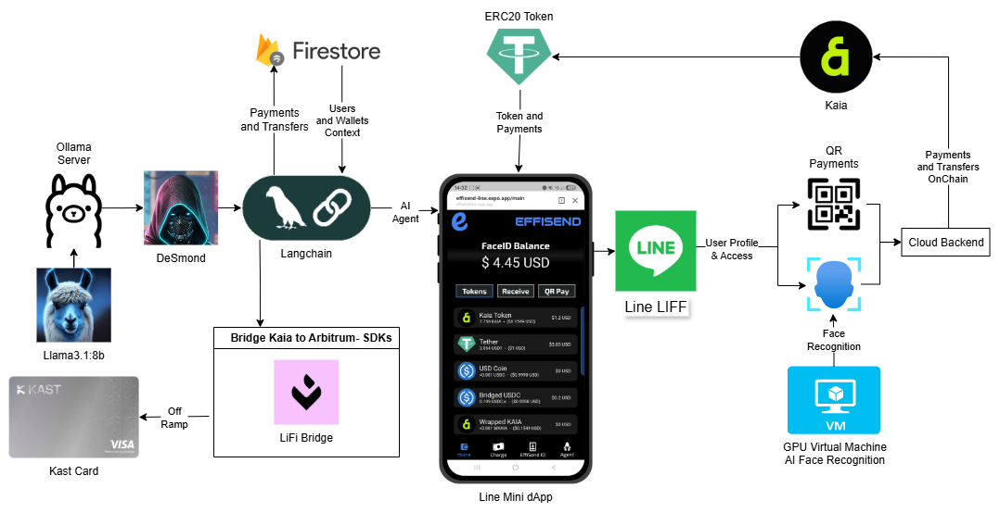
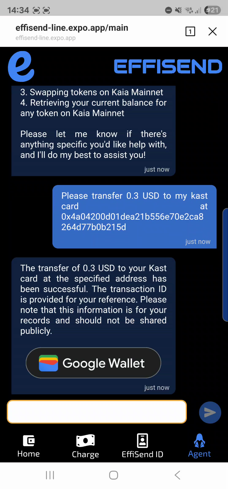

# EffiSend-Line

<p align="center">

</p>

EffiSend reimagines digital payments by combining the security of biometric authentication with the convenience of conversational AI, all within the trusted **LINE ecosystem** as a native Mini DApp. Built on the **Kaia** blockchain and integrated seamlessly into LINE's 95+ million user base across Asia, our platform makes crypto transactions as simple as showing your face or having a chat with our AI assistant, DeSmond—no app downloads required. 

We're not just processing payments—we're building a trust-based ecosystem where your verified identity becomes your gateway to seamless financial interactions and meaningful rewards, leveraging LINE's existing social infrastructure to bring Web3 payments to mainstream users who already trust and use LINE daily.

## 🔗 Fast Links
- **LINE DAPP**: SCAN WITH YOUR LINE APP
<p align="center">

</p>

<hr>

- **MINI DAPP:** [LINK](https://liff.line.me/2008048994-LZJ5wpAN)

<hr>

- **DUNE ANALYTICS:** [LINK](https://dune.com/altaga/effisend)

<hr>

- **VIDEO DEMO:** [LINK](https://www.youtube.com/watch?v=ipT9MxahQEk)

<hr>

- **YIELD VIDEO DEMO:** [LINK](https://www.youtube.com/watch?v=IIvgoejg5BU)

## 🎯 Project Value & Justification

**Enabling Face Payments within LINE represents a paradigm shift in digital finance accessibility.** 

Traditional crypto payments require complex wallet management, private key security, and technical knowledge that creates barriers for mainstream adoption. EffiSend eliminates these friction points by introducing **biometric-authenticated payments directly within LINE**—the app millions of users already trust and use daily.

### Why This Matters:

- **Zero Learning Curve**: Users can make crypto payments using familiar LINE interface with just their face—no new apps, no wallet setup, no seed phrases to remember
- **Instant Trust**: LINE's established reputation and user base provides immediate credibility for crypto transactions
- **Biometric Security**: Face authentication offers stronger security than passwords while being more user-friendly than traditional wallet management
- **Social Integration**: Payments become as natural as sending a LINE message, enabling peer-to-peer transactions within existing social contexts
- **Mass Market Ready**: Transforms crypto from a niche technology into an accessible payment method for LINE's 95+ million users

By bringing **Face Payments to LINE**, EffiSend bridges the gap between Web3 innovation and mainstream usability, making cryptocurrency payments as intuitive as taking a selfie.

## ⚙️ System Architecture & Tech Stack

We've designed EffiSend with a modern Web3 architecture that prioritizes what matters most: speed, security, and simplicity. Every component works together to create an experience that feels familiar yet powered by cutting-edge blockchain technology.



*(The system diagram illustrates how the EffiSend frontend and backend services interact with the Kaia network. The USDT token is shown as the primary asset for rewards and payments.)*

### Kaia & Line Components:

  - [**LINE LIFF (LINE Front-end Framework)**](https://developers.line.biz/en/docs/liff/)
    The foundation of our LINE integration that transforms EffiSend into a native LINE Mini DApp. LIFF enables seamless authentication, profile access, and social features within LINE's trusted ecosystem. Our LIFF provider manages the entire lifecycle from initialization to user authentication, ensuring EffiSend works flawlessly whether accessed through LINE mobile app, LINE web client, or direct browser access.

  - [**Kaia**](https://kaia.io/)
    Our blockchain of choice for its high-performance infrastructure and developer-friendly environment. Kaia's EVM-compatible architecture perfectly matches our vision of making crypto payments feel instant and affordable, whether you're buying coffee or sending money across the globe.

  - [**USDT**](https://tether.to/)
    We chose USDT as our primary currency because stability matters when you're dealing with real money. No one wants to worry about price volatility when splitting a dinner bill or earning rewards for platform activity.

  - [**Langchain (AI Agent)**](https://www.langchain.com/)
    The brain behind DeSmond, our conversational AI assistant. Instead of navigating complex interfaces, users can simply tell DeSmond what they want to do—"send $50 to Alice" or "check my balance"—and it handles the rest.

  - [**DeepFace**](https://viso.ai/computer-vision/deepface/)
    The technology that makes our Face-ID system both secure and user-friendly. With built-in anti-spoofing protection, you can trust that only you can access your wallet—no passwords to remember, no keys to lose.

## 📱 LINE Integration & LIFF Framework

EffiSend is built as a **LINE Front-end Framework (LIFF)** application, transforming it into a native LINE Mini DApp. This integration leverages LINE's 95+ million user ecosystem across Asia, eliminating app installation barriers and providing trusted, seamless authentication through LINE's existing infrastructure.

  

### LIFF Provider Implementation

Our LIFF provider manages the complete LINE integration lifecycle, automatically detecting whether the app runs in LINE's mobile app, web client, or browser, while handling authentication and profile access:

```javascript
const initializeLiff = async () => {
  const liffModule = await import("@line/liff");
  const liffInstance = liffModule.default;
  
  await liffInstance.init({ liffId: process.env.EXPO_PUBLIC_LIFF_ID });
  setLiff(liffInstance);
  setIsLineApp(liffInstance.isInClient());
  
  if (liffInstance.isLoggedIn() || liffInstance.isInClient()) {
    const userProfile = await liffInstance.getProfile();
    setProfile(userProfile);
    setIsLoggedIn(true);
  }
};
```

This positions EffiSend as a native part of users' daily digital routine, making crypto payments as accessible as sending a LINE message.

## 📊 Dune Analytics Dashboard

As part of our submission requirements, we've created a comprehensive **Dune Analytics dashboard** that provides real-time insights into EffiSend's platform metrics and ecosystem health. This dashboard serves as a transparent window into our platform's adoption and performance on the Kaia blockchain.

### Key Metrics Tracked

Our Dune dashboard monitors three critical aspects of the EffiSend ecosystem:

- **Unique Users**: Real-time tracking of unique wallet addresses interacting with EffiSend, providing insights into user adoption and platform growth
- **Rewarded Users**: Analytics on users who have claimed rewards through our identity-based rewards system, showcasing platform engagement and incentive effectiveness  
- **KAIA Price**: Live price tracking of the KAIA token, essential for understanding the economic context of our blockchain operations

### Dashboard Access

The dashboard is publicly accessible and provides stakeholders, users, and the community with transparent visibility into EffiSend's on-chain activity and growth metrics. This data-driven approach demonstrates our commitment to transparency and helps validate the real-world impact of our LINE-integrated crypto payment solution.

**View Dashboard:** [https://dune.com/altaga/effisend](https://dune.com/altaga/effisend)

## 🤳 FaceID

EffiSend enables seamless and secure payments through facial recognition and linking a user’s unique biometric profile directly to their wallet.

  

Behind the scenes, our Face-ID system works through an elegant two-step process:

1.  **`fetchOrSave`:** This function first attempts to find an existing user via facial recognition. If no match is found, it securely saves the new user's facial embedding, linking it to their new account.
2.  **`fetch`:** This function is used for subsequent logins and transaction authorizations, performing a search-only operation to retrieve user data upon a successful facial match.

This biometric system is isolated from other services to ensure maximum security.

#### User Verification Snippet

  - Fetch or Save:

<!-- end list -->

```python
@app.post("/fetchOrSave", dependencies=[Depends(check_api_key)])
async def findUser(item: ItemUserFace):
    try:
        result = DeepFace.find(
            img_path=item.image,
            db_path=DB_DIR,
            anti_spoofing=True
        )
        # Simplified result parsing
        return {"result": result[0].identity[0]}
    except Exception:
        # Save new user image
        save_image(item.image, item.nonce)
        return {"result": True}
```

  - Fetch:

<!-- end list -->

```python
@app.post("/fetch", dependencies=[Depends(check_api_key)])
async def findUser(item: ItemUserFace):
    try:
        result = DeepFace.find(
            img_path=item.image,
            db_path=DB_DIR,
            anti_spoofing=True
        )
        # Simplified result parsing
        return {"result": result[0].identity[0]}
    except Exception:
        return {"result": False}
```

## 📊 Batch Balances Contract

Our BatchBalances contract demonstrates a best practice for improving UI performance by fetching multiple token balances in a single call.

```solidity
// SPDX-License-Identifier: GPL-3.0
pragma solidity ^0.8.23;

import {ERC20} from "@openzeppelin/contracts/token/ERC20/ERC20.sol";

contract BatchBalances {
    // Get balances for multiple tokens in one call
    function batchBalanceOf(address _owner, address[] memory _tokenAddresses)
        public view returns (uint256[] memory) {
        uint256[] memory balances = new uint256[](_tokenAddresses.length);
        for (uint256 i = 0; i < _tokenAddresses.length; i++) {
            balances[i] = ERC20(_tokenAddresses[i]).balanceOf(_owner);
        }
        return balances;
    }

    // Get decimals for multiple tokens in one call
    function batchDecimals(address[] memory _tokenAddresses)
        public view returns (uint256[] memory) {
        uint256[] memory decimals = new uint256[](_tokenAddresses.length);
        for (uint256 i = 0; i < _tokenAddresses.length; i++) {
            decimals[i] = ERC20(_tokenAddresses[i]).decimals();
        }
        return decimals;
    }

    // Get allowances for multiple tokens in one call
    function batchAllowanceOf(address _owner, address _spender, address[] memory _tokenAddresses) 
        public view returns (uint256[] memory) {
        uint256[] memory allowances = new uint256[](_tokenAddresses.length);
        for (uint256 i = 0; i < _tokenAddresses.length; i++) {
            allowances[i] = ERC20(_tokenAddresses[i]).allowance(_owner, _spender);
        }
        return allowances;
    }
}
```

Instead of making separate calls for each token balance, this contract batches multiple queries into a single transaction. This reduces network overhead and creates faster, more responsive user interfaces—especially important when EffiSend needs to quickly show your complete portfolio.

All technical implementations for this module are included here.

  - [**Batch Balances**](./contract/batchbalances.sol)

## 💳 Payments:

We've streamlined the payment experience around **USDT** because predictable value matters in everyday transactions. Whether you're a merchant accepting payments or a customer making purchases, you shouldn't have to worry about price swings affecting your transaction.

- The merchant or user initiates a payment request. Afterward, the customer’s QR code—similar to Alipay—or facial recognition is scanned. Once verified, the system displays the available tokens, allowing the user to proceed with the payment.

    

- Every transaction generates a permanent record on the blockchain and a digital receipt for your records. Need proof of payment? It's all there, verifiable and tamper-proof, with the option to print or email receipts for traditional record-keeping.

    

### Crypto Payment Main Code

```javascript
const wallet = new Wallet(privateKey, provider);
let transaction;
if (req.body.token === 0) {
  transaction = {
    to: req.body.destination,
    value: parseEther(req.body.amount)
  }
} else {
  const interface = new Interface(abiERC20);
  const data = interface.encodeFunctionData("transfer", [
    req.body.destination,
    parseUnits(
      req.body.amount,
      tokens[req.body.token].decimals
    ),
  ]);
  transaction = {
    to: tokens[req.body.token].address,
    data
  }
}
const result = await wallet.sendTransaction(transaction);
```

All technical implementations for this module are included here.

  - [**Fetch Account**](./kaia-functions/kaia-fetch-or-create.js)
  - [**Execute Payment**](./kaia-functions/kaia-execute.js)

## 🎁 Rewards

EffiSend’s identity-based rewards model encourages platform engagement. Users earn **USDT** tokens for completing a certain number of transactions or actions, fostering a vibrant and active community.


  

Your **Trust Score** grows with your on-chain reputation. We analyze your transaction patterns and community involvement on Kaia to identify engaged, trustworthy users. Higher trust scores unlock better rewards and personalized recommendations—it's like a credit score, but for the decentralized world.

### New Account Snippet.

```javascript
const wallet = Wallet.createRandom();
let dataframe = {
    privateKey: wallet.privateKey,
    address : wallet.address,
    user,
    rewards:"0.01"
}
await Accounts.doc(user).set(dataframe);
```

### Reward Snippet.

```javascript
const { rewards, user } = query.docs[0].data();
if (rewards <= 0) {
    throw "NO REWARDS"
}
const tx = await contract.transfer(_address, parseUnits(rewards, 6));
const dataFrameTemp = query.docs[0].data();
const dataframe = {
    ...dataFrameTemp,
    rewards: "0"
}
await Accounts.doc(user).set(dataframe);
```

All technical implementations for this module are included here.

  - [**Create or Fetch Account**](./kaia-functions/kaia-fetch-or-create.js)
  - [**Claim Rewards**](./kaia-functions/kaia-claim.js)

## 🤖 AI Agent (DeSmond)

Meet **DeSmond**, your personal crypto assistant who speaks human, not blockchain jargon. Built with **Langchain**, DeSmond turns complex wallet operations into simple conversations. Just tell him what you want to do with your money, and he'll handle the technical details.

  

### Agent Tools & Capabilities

DeSmond is smart enough to understand context and intent, then choose the right action for your request. Here's what he can help you with:

**Core Wallet Functions:**
  - **`get_balance_kaia`**: Retrieves your current token balance for any token on Kaia Mainnet
  - **`transfer_tokens`**: Facilitates token transfers on the Kaia Mainnet
  - **`swap_tokens`**: Enables token swaps on Kaia using Li.Fi's routing

**Yield Farming Functions:**
  - **`get_yield_balance`**: Shows your currently deposited KAIA balance in the yield farm
  - **`get_pending_rewards`**: Displays your unclaimed DES token rewards
  - **`yield_kaia`**: Deposits KAIA tokens into the yield farm to start earning
  - **`withdraw_kaia`**: Withdraws your deposited KAIA from the yield farm
  - **`withdraw_rewards`**: Claims your earned DES token rewards
  - **`get_yield_info`**: Provides information about yield farming capabilities

**Utility Functions:**
  - **`fund_kast_card`**: Transfers USDT from Kaia to your MetaMask Card on Arbitrum
  - **`list_of_tools`**: Shows all available DeSmond capabilities
  - **`fallback`**: Provides friendly responses when your intent needs clarification

All technical implementations for this module are included here.

  - [**Agent Code**](./agent/index.js)

### Special Methods:

DeSmond also bridges the gap between crypto and traditional spending through MetaMask Card integration. When you want to load your MetaMask Card with USDT, just ask—he'll handle the conversion and transfer seamlessly.


  - **`fund_metamask_card`**: Enables the user to fund their MetaMask card.

<!-- end list -->

```javascript
const fundKastCard = tool(
  async ({ amount, to }, { configurable: { user } }) => {
    const response = await fetchURL(process.env.TOP_UP_PAYMENT_API, {
      user,
      amount,
      to,
    });
    console.log(response);
    if (response === null) {
      return JSON.stringify({
        status: "error",
        message: "Transaction failed.",
      });
    }
    const { hash } = response;
    return JSON.stringify({
      status: "success",
      message: "Your USDT has been transferred to your Kast Card.",
      transaction: hash,
    });
  },
  {
    name: "fund_kast_card",
    description:
      "This tool facilitates transfers where the specified amount is in USD, but the sending token is USDT on the Kaia Mainnet to USDT on Arbitrum. It generates transaction data for the user to sign and activates when the user explicitly opts to send USD to a Kast Card or mentions relevant terms such as 'transfer,' 'USDT,' 'Kaia Mainnet,' or 'Kast Card' in the context of wallet activity.",
    schema: z.object({
      amount: z.string(),
      to: z.string(),
    }),
  }
);
```

### Agent Code Snippets

All technical implementations for this module are included here.

  - [**Agent Code**](./agent/index.js)
  - [**Fund KAST Card**](./kaia-functions/kaia-usdt-arbitrum.js)

## 🔄 Swap Tokens

EffiSend integrates with Li.Fi to provide seamless token swapping directly within the platform. Users can easily exchange between different tokens on Kaia—whether converting KAIA to USDT for payments or diversifying their portfolio across supported assets.

Our swap functionality supports major tokens on Kaia including KAIA, USDT, WBTC, WETH, and other popular assets. The system automatically handles token approvals when needed and provides real-time quotes to ensure users get the best rates available.

### Key Features:

- **Automatic Routing**: Li.Fi finds the most efficient swap routes
- **Smart Approvals**: Handles ERC20 token approvals automatically  
- **Real-time Quotes**: Always shows current market rates
- **Transaction Tracking**: Full visibility with Kaia explorer links

### Swap Process Snippet:

```javascript
// Get quote for token swap
const quote = await getQuote({
  fromChain: chainId,
  toChain: chainId,
  fromAmount: parseUnits(amount, tokenFrom.decimals),
  fromToken: tokenFrom.address,
  toToken: tokenTo.address,
  fromAddress: userAddress,
  toAddress: userAddress
});

// Execute the swap
const route = convertQuoteToRoute(quote);
const tx = await wallet.sendTransaction(route.steps[0].transactionRequest);
```

All technical implementations for this module are included here.

  - [**Swap Tokens**](./kaia-functions/kaia-swap-tokens.js)

## 🌾 Yield Farming

Stake your KAIA tokens to earn **DES (DeSmondToken)** rewards. Simple farming with flexible deposits and withdrawals.

  

- **YIELD VIDEO DEMO:** [LINK](https://www.youtube.com/watch?v=IIvgoejg5BU)

### How It Works

1. **Deposit KAIA**: Stake any amount to start earning
2. **Earn DES**: Rewards accumulate automatically over time  
3. **Claim Anytime**: Withdraw rewards or principal whenever you want

Your rewards are calculated based on how much KAIA you deposit and how long you keep it staked. The longer you farm, the more DES tokens you earn.

### Key Features

- **No Lock-up Period**: Withdraw your KAIA anytime
- **Continuous Rewards**: DES tokens earned
- **Emergency Safety**: Protected withdrawals during system maintenance
- **DeSmond Integration**: Manage your farm through AI chat

All technical implementations for this module are included here.

  - [**YieldFarm Contract**](./contracts/yieldfarm.sol)
  - [**DeSmondToken Contract**](./contracts/DeSmondToken.sol)
  - [**YieldFarm Interface**](./contracts/IYieldFarm.sol)
  - [**DeSmondToken Interface**](./contracts/IDeSmondToken.sol)

# Korea <> Effisend:

